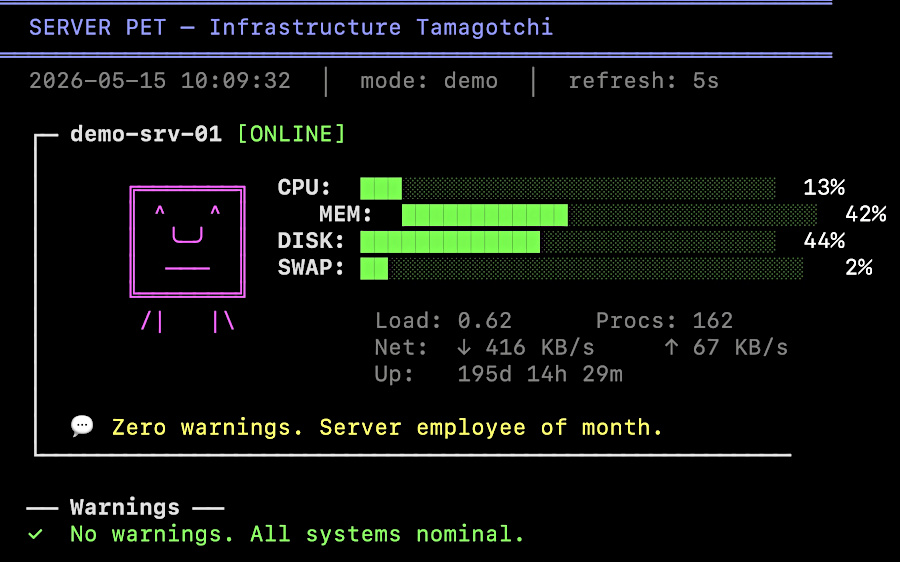

# server-pet.sh — Tamagotchi-style Linux server dashboard

Bash SSH dashboard that turns server metrics into a living creature with health bars, warnings, and status quips.



## What it do:
- ASCII creature changes mood based on server health (happy/okay/worried/stressed/dead/sleeping)
- Color-coded bar graphs for CPU, MEM, DISK, SWAP
- Uptime, load, process count, network stats
- Funny status messages per mood (rotating)
- Warning panel with threshold alerts
- Keyboard controls: q quit, r refresh, +/- speed

## Run it:
```sh
# Demo mode (random simulated data)
./server-pet.sh --demo

# Real servers via SSH
./server-pet.sh -s admin@prod-1 -s admin@prod-2

# Custom refresh
./server-pet.sh -s admin@prod-1 -r 10
```

Thresholds: CPU/MEM warn at 70%, crit at 90%. Disk warn 80%, crit 95%. All configurable at top of script.

Demo mode runs with no servers configured — randomizes stats, occasional spikes. Try it: `./server-pet.sh`

<br>
